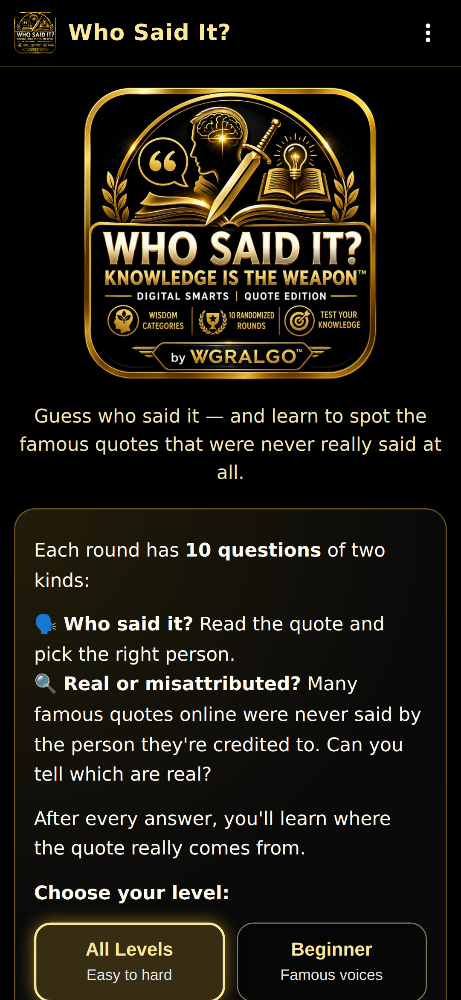
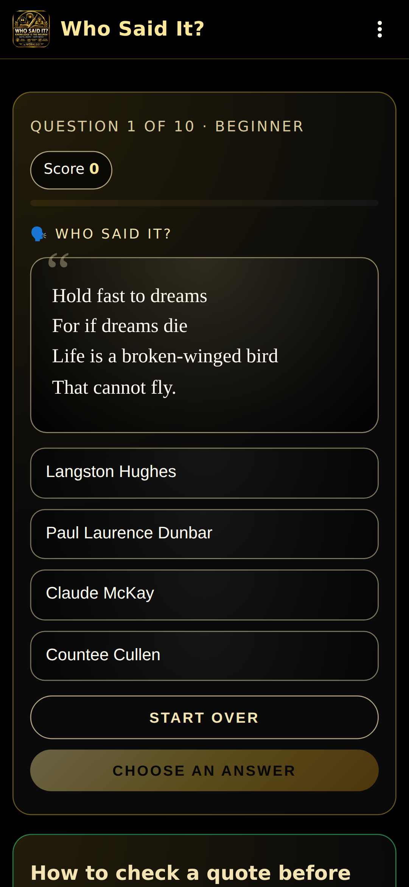
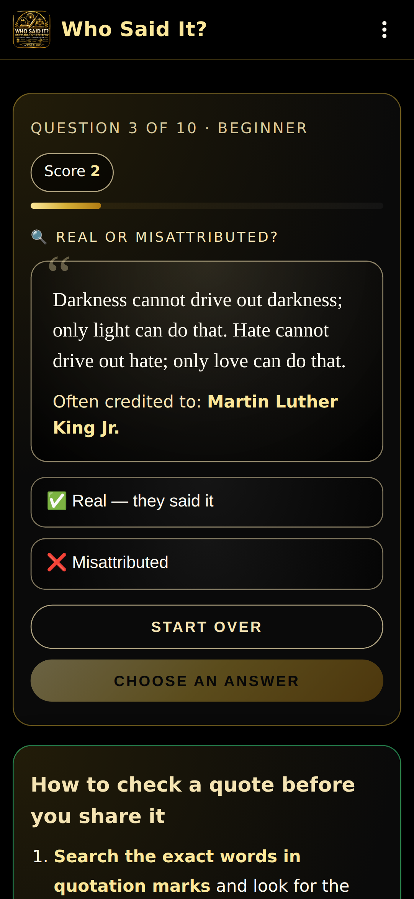
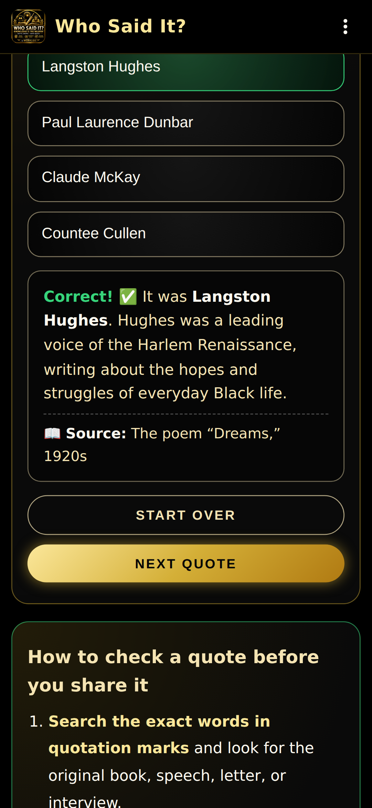
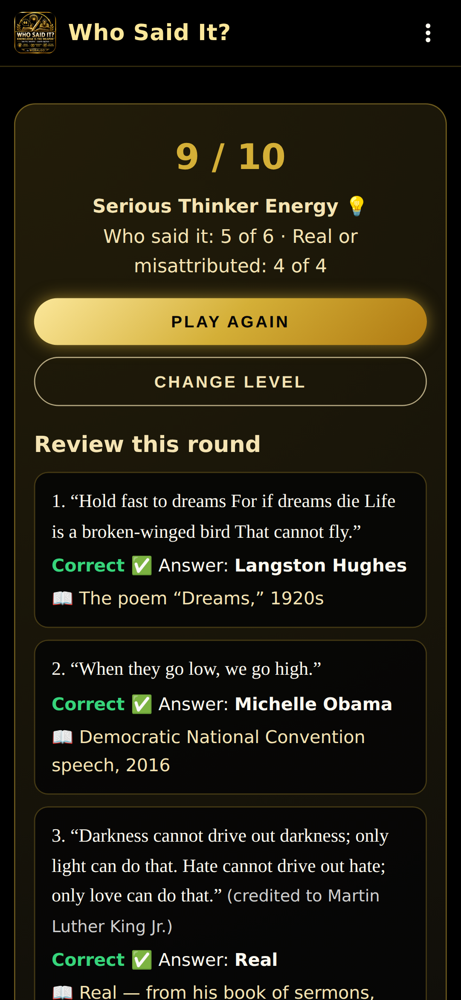
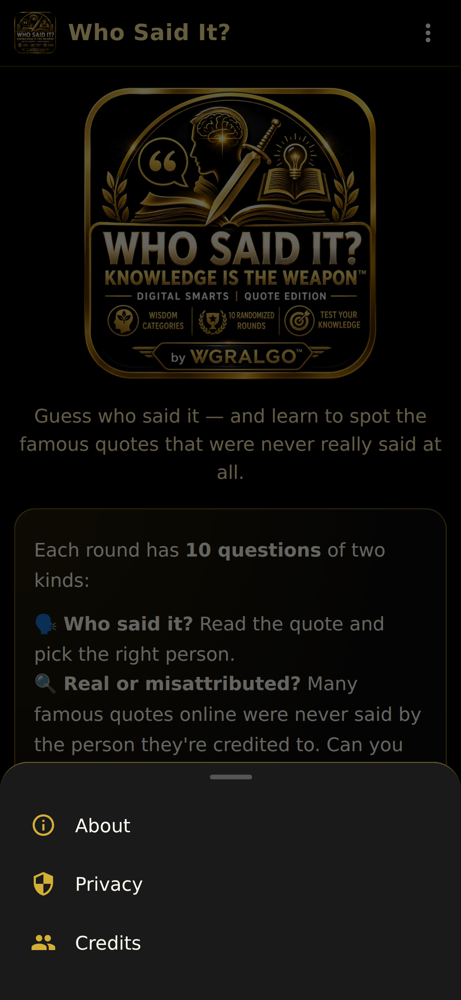
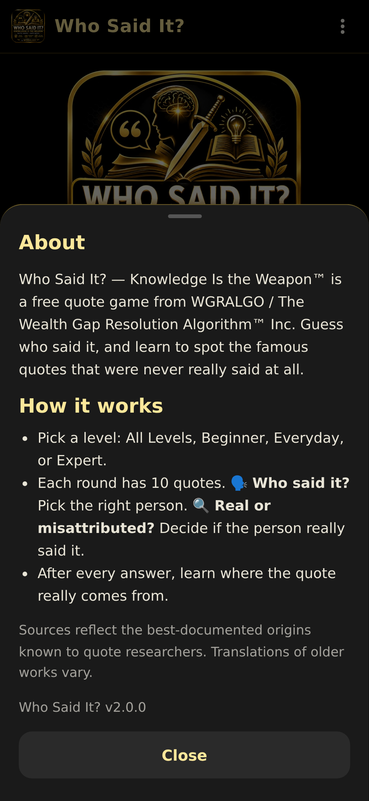
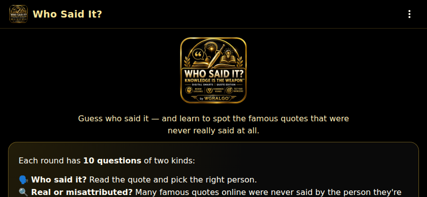
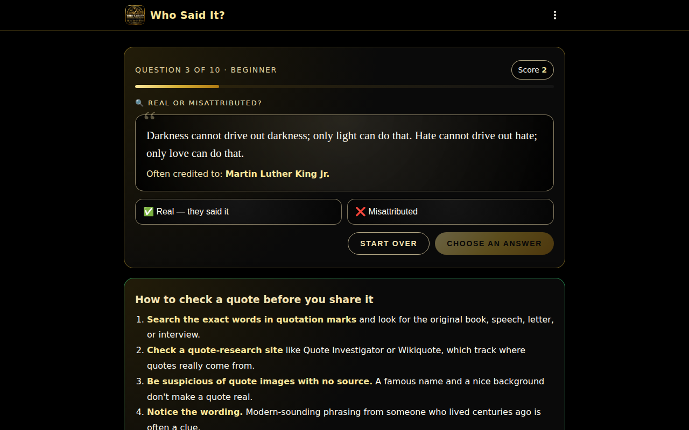
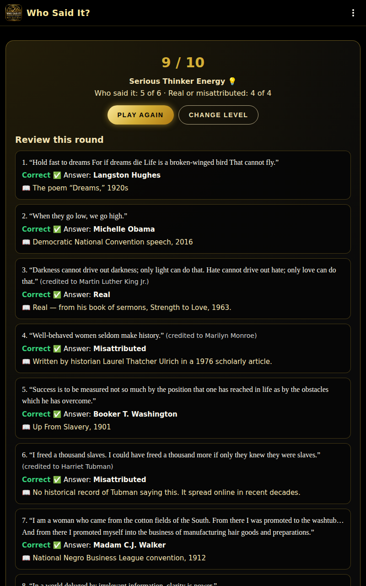

# WGRALGO Who Said It? — Knowledge Is the Weapon Edition

Who Said It? — Knowledge Is the Weapon™ Edition is a free educational Android app from The Wealth Gap Resolution Algorithm™ Inc. Guess who said it, and learn to spot the famous quotes that were never really said at all.

The app is fully offline, contains no ads, no analytics, no trackers, and asks for no permissions.

- **Version:** 2.0.0
- **Devices:** phones and tablets, portrait and landscape
- **Package:** `org.wgralgo.whosaiditknowledgeweapon`
- **License:** GPL-3.0-only

---

## Features

- **66 quotes** across three levels: **Beginner** (famous voices), **Everyday** (writers and builders), and **Expert** (deep cuts), plus an **All Levels** round that goes from easy to hard.
- Two kinds of questions in every round of 10:
  - 🗣️ **Who said it?** Read the quote and pick the right person.
  - 🔍 **Real or misattributed?** Many famous quotes online were never said by the person they're credited to. Can you tell which are real?
- After every answer, learn the real source and the story behind the quote.
- Score, progress bar, and results with a review of every quote.
- **How to check a quote before you share it:** four simple steps, always on screen.
- **Looks like a real app:** black launch screen with the big logo, a launcher icon that fits round, squircle, and square shapes, a solid app bar, About / Privacy / Credits panels, and Android back-button support (back asks before quitting a round, returns to the level picker from results, and asks before exiting the app).
- **Phones and tablets, portrait and landscape:** the app rotates freely. On phones turned sideways the start-screen logo is smaller so the game starts on screen; on tablets the answers spread into two columns.
- Fully offline: no internet permission, no network calls. No accounts, no ads, no analytics, no trackers.

## Screenshots

| Launch | Home | Who said it? | Real or misattributed? |
|---|---|---|---|
|  |  |  |  |

| Feedback | Results | Menu | About |
|---|---|---|---|
|  |  |  |  |

Phones and tablets:

| Phone, landscape | Tablet, landscape | Tablet, portrait |
|---|---|---|
|  |  |  |

## How to install / sideload the APK

1. Download `WGRALGO-WhoSaidIt-v2.0.0.apk` from the [GitHub Releases](../../releases) page.
2. On your Android phone or tablet, allow installs from your browser or file manager (Settings → Apps → Special access → Install unknown apps).
3. Open the downloaded APK and tap **Install**.
4. Optional integrity check (Linux/macOS):
   ```bash
   sha256sum WGRALGO-WhoSaidIt-v2.0.0.apk
   ```
   Compare the output with `WGRALGO-WhoSaidIt-v2.0.0.apk.sha256` from the same release.

> **Upgrading from v1.0.0?** Version 2.0.0 is signed with a new key, so it
> can't install over the old app. Uninstall v1.0.0 first, then install v2.0.0.
> The app saves nothing on your device, so nothing is lost.

### Signing certificate (v2.0.0 and later)

- `CN=WGRALGO, OU=Who Said It, O=The Wealth Gap Resolution Algorithm Inc, C=US`
- SHA-256: `1E:F2:05:BB:C2:13:EC:AF:A3:95:80:AE:D2:80:8D:97:32:7D:10:80:DA:88:80:7F:A9:7B:6B:92:57:1A:C7:6C`

```bash
apksigner verify --print-certs WGRALGO-WhoSaidIt-v2.0.0.apk
```

## How to build from source

Requires Node.js 18+, Java 17, and the Android SDK.

```bash
git clone https://github.com/WGRALGO/WGRALGO-Who-Said-It.git
cd WGRALGO-Who-Said-It
npm install
npx cap sync android
cd android
./gradlew assembleDebug
```

The debug APK lands at `android/app/build/outputs/apk/debug/app-debug.apk`.

### Signed release build

Release signing uses `android/keystore.properties` **or** environment variables (`WSI_KEYSTORE_FILE`, `WSI_KEYSTORE_PASSWORD`, `WSI_KEY_ALIAS`, `WSI_KEY_PASSWORD`). The keystore and its passwords are **never** committed to git.

```bash
npx cap sync android
cd android
./gradlew assembleRelease
```

Output: `android/app/build/outputs/apk/release/app-release.apk`.

Check a build before publishing:

```bash
bash tools/validate-release.sh android/app/build/outputs/apk/release/app-release.apk
```

The launcher icon, splash images, and in-app logo are generated from `assets/icon.png` with `python3 tools/build-icons.py` (run from the repo root).

## Continuous integration and releases

- [`.github/workflows/android.yml`](.github/workflows/android.yml) builds a debug APK on every push and pull request.
- [`.github/workflows/release.yml`](.github/workflows/release.yml) builds, validates, signs, and publishes `WGRALGO-WhoSaidIt-v<version>.apk` with its `.sha256` to GitHub Releases. Run it from the **Actions** tab or push a `v*` tag. It needs these repository secrets: `WSI_KEYSTORE_BASE64`, `WSI_KEYSTORE_PASSWORD`, `WSI_KEY_ALIAS`, `WSI_KEY_PASSWORD`.

## Privacy summary

- No account required
- No ads
- No analytics
- No trackers
- No cloud upload
- No data selling
- No personal data is collected
- No answers or scores are sent to WGRALGO
- The app is an offline educational quote-recognition game

Full statement: [PRIVACY.md](./PRIVACY.md).

## Educational disclaimer

Who Said It? — Knowledge Is the Weapon™ Edition is for educational awareness and entertainment only. Quote attributions should be treated carefully, and users should verify important quote history through trusted sources. The app does not provide legal, financial, medical, academic, or professional advice.

## Quote attribution note

Quote attributions are drawn from widely-cited public records (primary sources, published speeches, well-documented letters, and major scholarly references). Where attribution is contested, the in-app explanation credits the popularizer and flags the dispute (for example, the "survival of the most adaptable" quote is attributed to Leon C. Megginson, not Darwin; the "we are what we repeatedly do" formulation is attributed to Will Durant, not Aristotle directly).

If you find an attribution error, please open an issue on this repository with a primary-source citation and we will fix it in the next release.

## License

This project is released under the GNU General Public License v3.0. See [LICENSE](./LICENSE).

## Contributors

See [CONTRIBUTORS.md](./CONTRIBUTORS.md).
